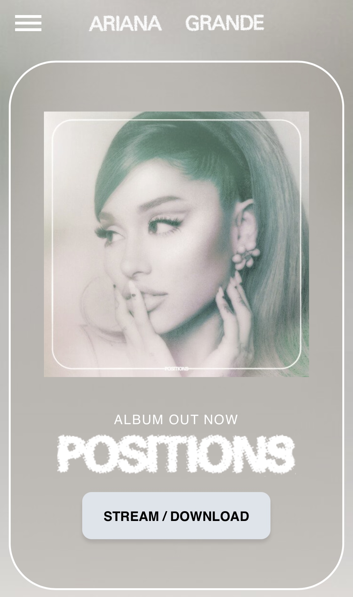
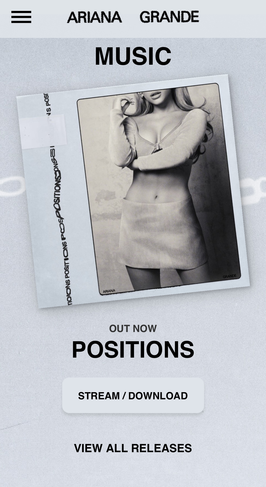

# Procesverslag
**Auteur:** Vera van Maaren

## Bronnenlijst
1. -bron 1-
2. -bron 2-
3. -...-

## Eindgesprek (week 7/8)

-dit ging goed & dit was lastig-

**Screenshot(s):**

-screenshot(s) van je eindresultaat-

## Voortgang 3 (week 6)

-same as voortgang 1-

## Voortgang 2 (week 5)

-same as voortgang 1-

## Voortgang 1 (week 3)

### Stand van zaken

Ik heb op dit moment nog geen website online staan. Ik ben vooral bezig geweest met de opdrachten op Codepen en met Project. Het is allemaal een beetje messy, ik midden in een verhuizing...

**Screenshot(s):**

-screenshot(s) van hoe ver je bent met korte uitleg-

### Agenda voor meeting

-samen met je groepje opstellen-

| student 1      | student 2          | student 3    | student 4        |
| ---            | ---                | ---          | ---              |
| dit bespreken  | en dit             | en ik dit    | en dan ik dat    |
| an dat ook nog | dit als er tijd is | nog een punt | dit wil ik zeker |
| ...            | ...                | ...          | ...              |

### Verslag van meeting

-na afloop snel uitkomsten vastleggen-

## Opdrachten Codepen
https://codepen.io/collection/nRdkJm

## Breakdownschets (week 1)

https://xd.adobe.com/view/14e8db71-6dc4-405d-8235-c26610c36197-41bb/?fullscreen

## Intake (week 1)

**Je startniveau:** blauw

**Je focus:** responsive

**Je opdracht:** www.arianagrande.com

**Screenshot(s) van de eerste pagina (small screen):**

**Screenshot(s) van de tweede pagina (small screen):**

