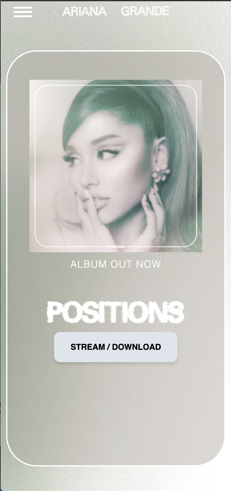
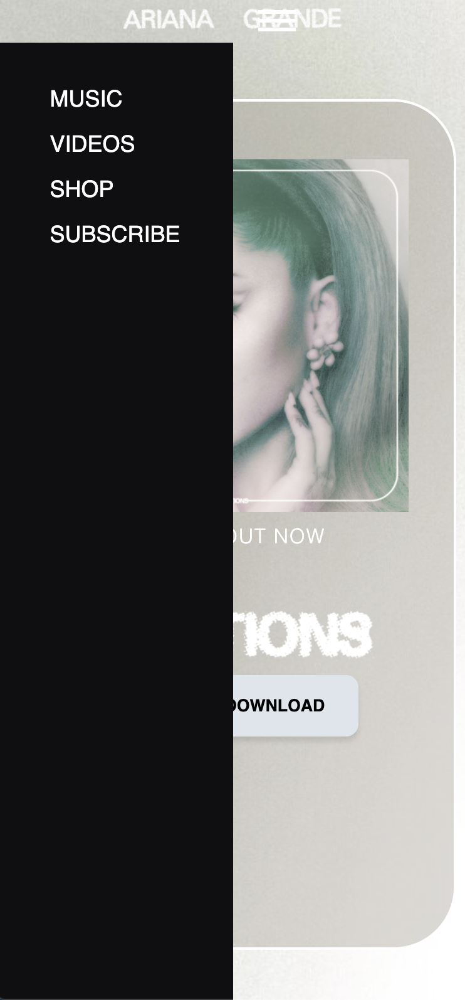
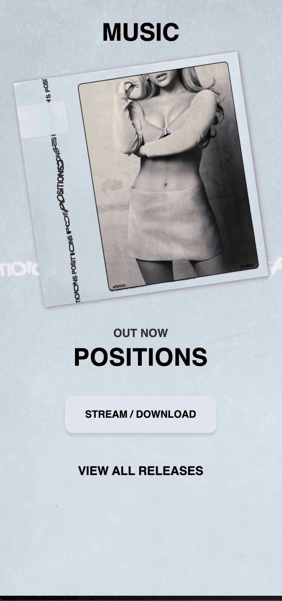
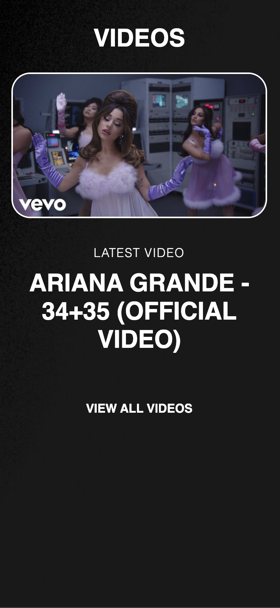
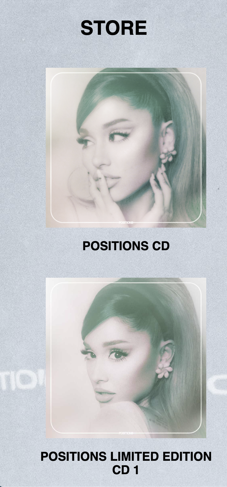
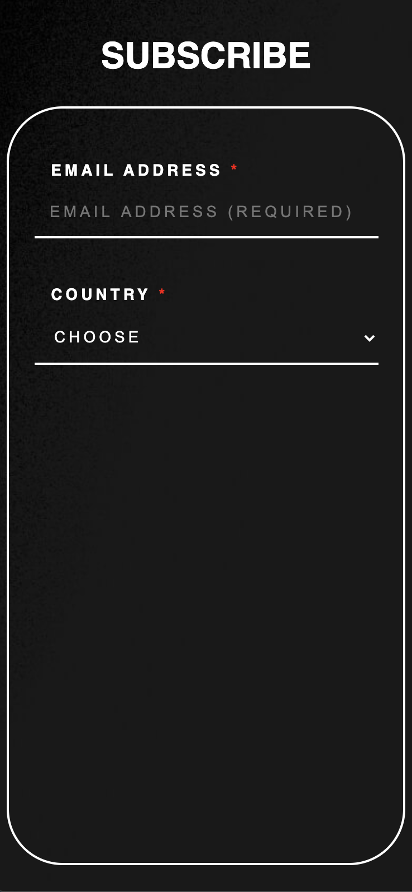
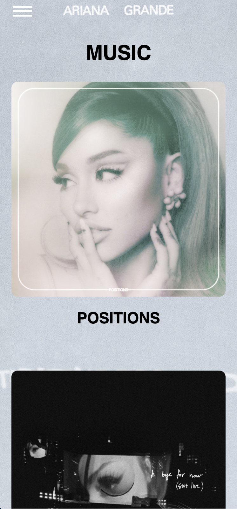
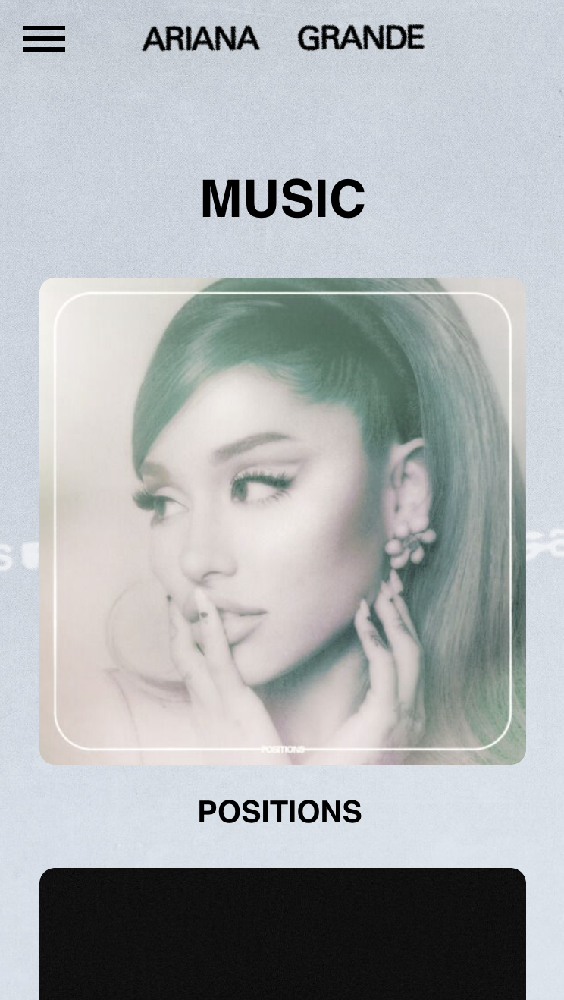

# Procesverslag
**Auteur:** Vera van Maaren

## Bronnenlijst
1. https://www.youtube.com/watch?v=rGAbT8ykGB0&ab_channel=Fireship > voor het slide in menu
2. https://www.w3schools.com/howto/howto_css_shake_image.asp > voor de keyframes om een goed shake effect te verkrijgen
3. https://www.arianagrande.com/ > uiteraard ter voorbeeld, maar hier en daar ook voor de code

## Herkansing
Ik heb de punten verwerkt die ik nog moest verwerken. Ik heb nu een tweede pagina welliswaar met een tweede css docuement, omdat hij anders ontzettend raar ging doen en ik kreeg dat niet opgelost. Verder doet mijn menu het nu ook en hebben de linkjes een vergelijkbare microinteractie als op de echte site.

**Screenshot(s):**

Screen 1

Screen 1 met menu

Screen 2

Screen 3

Screen 4

Screen 5

Screen 1 van de tweede pagina

## Eindgesprek (week 7/8)
Helaas was ik er niet aan toegekomen aan een aantal punten te voldoen die belangrijk waren voor de beoordeling. Ik had nog geen tweede pagina, mijn formulier was nog niet af, ik had nog niet echt gekeken naar toegankelijkheid en nog een aantal kleine puntjes. Dit moest ik meenemen naar de herkansing...

## Voortgang 3 (week 6 - 4 jan)
Ik had op dit moment al een stuk meer dan bij de voorgaande voortgangsgesprekken. Nu kon ik bespreken hoe ik dat leuke hover effectje op mijn button kreeg. Toen heb ik wel een nuttig linkje van Deanna ontvangen. Verder was het ook heel cool om te zien wat Nadine allemaal gemaakt had. De andere student was niet aanwezig.

**Screenshot(s):**
N.v.t.

### Agenda voor meeting
| Nadine         | student 2          |
| ---            | ---                |
| dit bespreken  | en dit             |
| an dat ook nog | dit als er tijd is |
| ...            | ...                |

## Voortgang 2 (week 5 - 14 dec)
Bij week 2 was ik nog steeds niet heel erg opgeschoten. Ik had nog steeds erg weinig. Desalniettemin heb ik wel feedback gekregen op hetgeen wat ik al wél had. Zo moest ik alle classes die ik had aangemaakt verwijderen en een slimmere manier gebruiken om elementen te stylen.

**Screenshot(s):**
N.v.t.

### Agenda voor meeting
| student 1      | student 2          |
| ---            | ---                |
| dit bespreken  | en dit             |
| an dat ook nog | dit als er tijd is |
| ...            | ...                |

## Voortgang 1 (week 3 - 30 nov)
Ik heb op dit moment nog geen website online staan. Ik ben vooral bezig geweest met de opdrachten op Codepen en met Project. Het is allemaal een beetje messy, ik zit midden in een verhuizing... Ik was ook aangesloten bij het verkeerde groepje, dus ik zat bij Justus en 2 andere jongens.

Ik heb goed mee kunnen kijken en feedback kunnen geven, dat is natuurlijk ook waardevol. Zo kreeg ik in ieder geval een goed beeld wat er van mij verwacht werd. Later in de week heb ik nog een gesprek met Justus gehad waarin hij mij kon helpen met de download van Visual Code en hoe handig Github daaarmee samenwerkt.

**Screenshot(s):**
N.v.t.

### Agenda voor meeting
| student 1      | student 2          |
| ---            | ---                |
| dit bespreken  | en dit             |
| an dat ook nog | dit als er tijd is |
| ...            | ...                |    

## Opdrachten Codepen
https://codepen.io/collection/nRdkJm

## Breakdownschets (week 1)
https://xd.adobe.com/view/14e8db71-6dc4-405d-8235-c26610c36197-41bb/?fullscreen

## Intake (week 1)
**Je startniveau:** blauw

**Je focus:** responsive

**Je opdracht:** www.arianagrande.com

**Screenshot(s) van de eerste pagina (small screen):**

**Screenshot(s) van de tweede pagina (small screen):**

